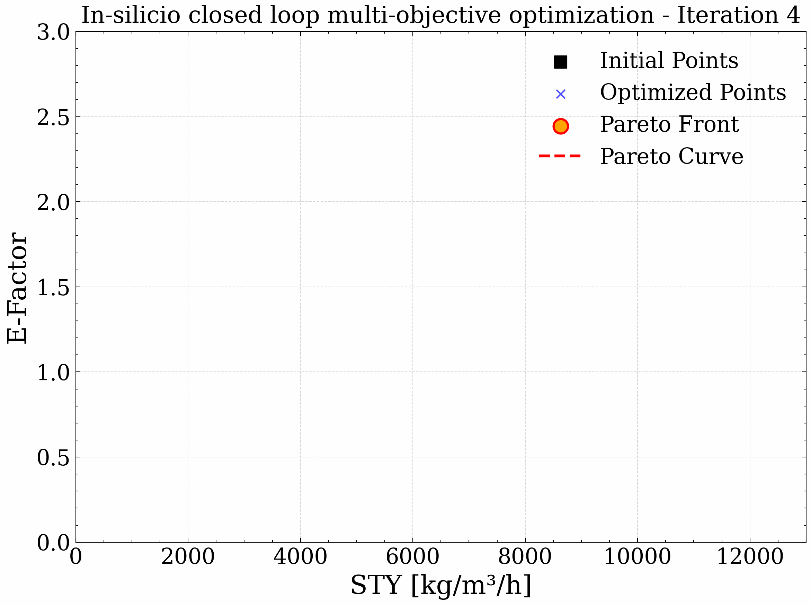

[](https://github.com/lennartthi/QuantumPareto/actions/workflows/quantumpareto.yml)

# QuantumPareto

A tool for automated in-silicio quantum multi objective optimization.

**Version 0.1.0**




## Features


## About


## Installation

This package is only compatible with Python **3.10**.

First install the `ipopt` solver and the `tamkin` package from conda-forge:
```bash
conda install -c conda-forge ipopt tamkin
```

Afterwards the rest of the dependencies can be installed via pip:
```bash
pip install git+https://github.com/lennartthi/QuantumPareto
```

## Usage

### Species and Transition States

### Reactions

### Kinetics and Solvation

### Optimization

## Running Tests

 Tests can be run via pytest:
```bash
pytest -v
```
Some tests require a large amount of time. If you want to skip these tests,
you can use the `-m` flag:
```bash
pytest -v -m "not slow"
```

## Licesnse
