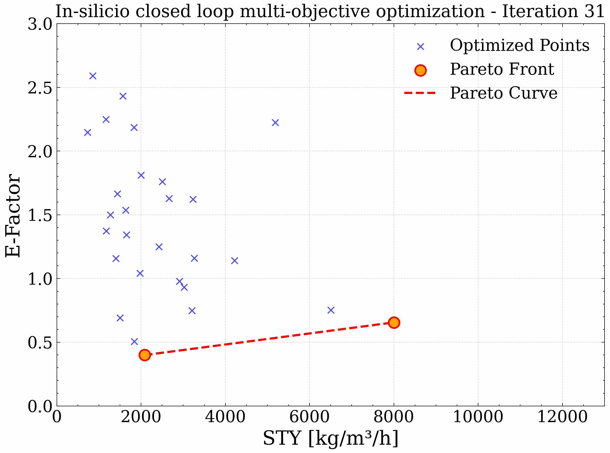

[](https://github.com/lennartthi/QuantumPareto/actions/workflows/quantumpareto.yml)

# QuantumPareto



## Installation

Python 3.10 only

```bash
conda install -c conda-forge ipopt tamkin
```


```bash
pip install -e .
```