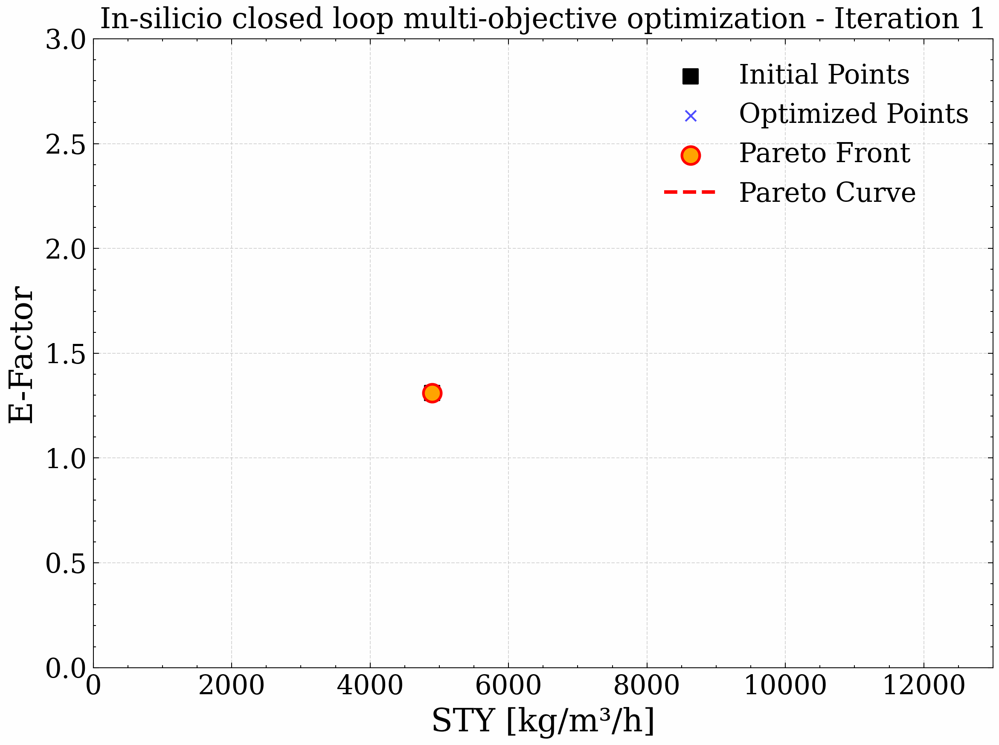

[](https://github.com/lennartthi/QuantumPareto/actions/workflows/quantumpareto.yml)

# QuantumPareto

A tool for automated in-silicio quantum multi objective optimization.

**Version 0.1.0**




## Features


## About


## Installation

This package is only compatible with Python **3.10**.

First install the `ipopt` solver and the `tamkin` package from conda-forge:
```bash
conda install -c conda-forge ipopt tamkin
```

Afterwards the rest of the dependencies can be installed via pip:
```bash
pip install git+https://github.com/lennartthi/QuantumPareto
```

## Workflow

1. CREST
2. GAUSSIAN -> `.fchk` files
3. COSMOTHERM -> `.tab` files

## Usage

A complete usage example is in `examples/system_1/tsemo/system_1.py`.

### Species and Transition States

Species are divided into general species and transition states. Species can be defined as following:

```python
from pathlib import Path
from quantumpareto.species import Species


species_A = Species(
    name="Species A",
    mass=0.00,  # in kg/mol
    fchk_file_path=Path("path/to/gaussian/file.fchk"),
    tab_file_path=Path("path/to/cosmotherm/file.tab"),
    energy=0.00  # optional, in Hartree
)
```

The energy for a species is optional. When not provided it is taken from the Gaussian `.fchk` file.
The `Species` class can be used to define reactants and product.

In addition there is a seperate class for defining transisiton states:

```python
from pathlib import Path
from quantumpareto.species import TransitionState


transisiton_state_A = TransitionState(
    name="Transition State A",
    fchk_file_path=Path("path/to/gaussian/file.fchk"),
    tab_file_path=Path("path/to/cosmotherm/file.tab"),
    energy=0.00  # optional, in Hartree
)
```

Transition state do not need any masses. Despite that the definition is the same as for the standard `Species` class.

### Reactions

Reactions are defined via simple addition and subtraction

```python
# C -> A + B
reaction = species_A + species_B - species_C
reaction.name = "A_plus_B_to_C"
reaction.transition_state = transition_state_ABC
```

Every reaction defined needs a transition state which can be set via the `Reaction.transisiton_state` property.

### Kinetics and Solvation

The `Kinetics` class is used to automatically calculate the needed reaction rate constants
on the fly. It takes in a list of reactions:

```python
from quantumpareto.kinetics import Kinetics

reactions = [
    reaction_1,
    reaction_2,
]
kinetics = Kinetics(
    reactions=reactions,
    tunneling_correction=None,
    gradient_threshold=1e-4,
    
)
```
Tunneling Correction `wigner, eckart and wagner` can also be specified here in addition
to the `gradient_threshold`. The gradient threshold is passed to the `tamkin.ConstrainExt`
treatment.

The $\Delta G_{solv}$ values are automatically extracted and then calculated based on
the `.tab` files for every species. The `Solvation` is also constructed with the same list
of reactions:

```python
from quantumpareto.solvation import Solvation

reactions = [
    reaction_1,
    reaction_2,
]
solvation = Solvation(
    reactions=reactions,
)
```

The grid of temperatures is interpolated to match the varying temperatures in the reactor.

### Reactor

The reactor is based on the reactions, the corresponding kinetics and the $\Delta G_{solv}$ values:

```python
from quantumpareto.reactor import Reactor

reactor = Reactor(
    reactions=reactions,
    kinetics=kinetics,
    solvation=solvation,
)
```

### Optimization

For the multi-objective optimization two different types of data has to be defined. On one hand we have to define the
`Species` (reactants and products) to be optimized:

```python
from quantumpareto.optimizer import OptimizationSpecies

optimization_species = OptimizationSpecies(
    reactant_1=species_A,
    reactant_2=species_B,
    products=[species_C,]
)
```
Here we start the reactor with `species_A` and `species_B` and would like to maximize the 
outcome of `Species_C`.

On the other hand we have to define the boundaries of the optimization:

```python
from quantumpareto.optimizer import OptimizationBoundaries

optimization_boundaries = OptimizationBoundaries(
    temperature=(60, 140),  # Celsius Degrees
    concentration_reactant_1=(100, 500),  #
    concentration_ratio=(1.0, 5.0),  # 
    time=(0.5, 2.0),  # Minutes
)
```

Here the concentration range of reactant 1 (`Species_A`) is provided. In addition the concentration of reactant 2 (`Species_B`)
is given with the `concentration_ratio` range. Furthermore the temperature range and the time is defined.

After defining Species, Reactions, Kinetics, Solvation and Optimization Boundaries the optimization can
begin:

```python
from pathlib import Path
from quantumpareto.optimizer import TSEmoOptimizer

optimizer = TSEmoOptimizer(
    species=optimization_species,
    boundaries=optimization_boundaries,
    reactor=reactor,
    output_directory=Path("/path/to/a/output/directory"),
    num_initial_points=4,
)
optimizer.run(num_iteration=100)
```
The optimizer takes in the previously defined elements. Additionally the numer
of random `LHS` points (`num_initial_points=4`) are defined to give the `TSEMO`
optimization a headstart.
Afterwards the optimization is run for `num_iteration=100` iterations.

## Output

In the output directory will be a file called `quantumpareto.log` which gives an overview of the input and logs every
optimization iteration.

Two folders will be created, `plots` and `data`. In the plots folder there will be for every iteration the data as a scatter
plot with the current pareto front. In the end an animation is generated. An example can be seen above.
In the data folder there will be four `.csv` files: 
- `corrections.csv`: thermal corrections evaluated on a fine grid
- `gsolv.csv`: 
- `kinetics.csv`: reaction rate constants evaluated on a fine grid
- `quantumpareto.csv` evaluations of the reactor model with reactor starting conditions and `E` and `STY`


## Running Tests

 Tests can be run via pytest:
```bash
pytest -v
```
Some tests require a large amount of time. If you want to skip these tests,
you can use the `-m` flag:
```bash
pytest -v -m "not slow"
```

## License
